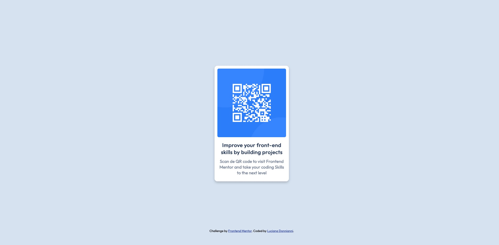

# Frontend Mentor - QR code component solution

This is a solution to the [QR code component challenge on Frontend Mentor](https://www.frontendmentor.io/challenges/qr-code-component-iux_sIO_H). Frontend Mentor challenges help you improve your coding skills by building realistic projects. 

## Table of contents

- [Overview](#overview)
  - [Screenshot](#screenshot)
  - [Links](#links)
- [My process](#my-process)
  - [Built with](#built-with)
  - [What I learned](#what-i-learned)
  - [Continued development](#continued-development)
  - [Useful resources](#useful-resources)
- [Author](#author)

**Note: Delete this note and update the table of contents based on what sections you keep.**

## Overview

### Screenshot




### Links

- Solution URL: [https://github.com/ldonnianni/QR-Code-Component]
- Live Site URL: [https://ldonnianni.github.io/QR-Code-Component/]

## My process

### Built with

- Semantic HTML5 markup
- CSS custom properties
- Flexbox


### What I learned

In order to complete this challenge I have to learned to use Git and Github, and its integrations with VS Code.
For the challenge on itself I learned to center the QR card in two different ways, with the translate properties and flexbox.

With translate properties.

```css
.container {
    position: absolute;
    top:50%;
    left:50%;
    transform: translate(-50%,-50%);
}
```

With Flexbox 

```css
.container {
    display: flex;
    flex-direction: column;
    justify-content: center;
    align-items: center;
}
```

I left the first option in the code. But not really know wich one is better.

I put attribution as a footer in the bottom.

```html
 <footer class="attribution">
      Challenge by <a href="https://www.frontendmentor.io?ref=challenge" target="_blank">Frontend Mentor</a>. 
      Coded by <a href="#">Luciana Donnianni</a>.
    </footer>
```

```css
footer {
    position: fixed;
    bottom: 20px;
    left: 0;
    right: 0;
}
```


### Continued development

I would like to have a better understanding with the workflow for mobile and desktop. And how to differenciate them.
I need to get a better grasp on the concept of position. Even though I watched tutorials and practice, in the challenges I kept struggling with it.


### Useful resources

- [freecodecamp](https://www.freecodecamp.org/) - In freecodecamp I finished the Responsive Web Design course where I learned everything I know of HTML and CSS.
- [Git and GitHub for Beginners Tutorial](https://www.youtube.com/watch?v=tRZGeaHPoaw&ab_channel=KevinStratvert) - This tutorial helped me to learn git and github, wich I knew nothing.
- [Visual Studio Code Crash Course](https://www.youtube.com/watch?v=WPqXP_kLzpo&ab_channel=freeCodeCamp.org) - From this tutorial I learned how VS code interact with Github.


## Author

- Frontend Mentor - [@ldonnianni](https://www.frontendmentor.io/profile/ldonnianni)


